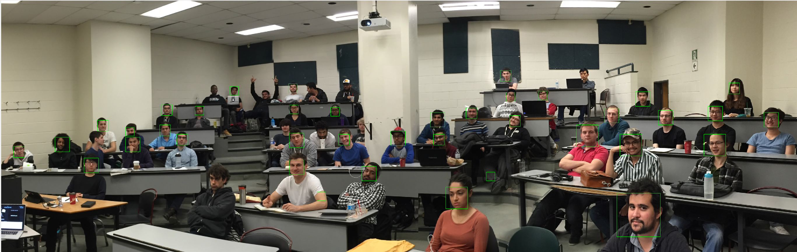

# Face Detector

Please unzip all .zip files into root project directory.

Run vlfeat/toolbox/vl_setup first

Run detect to see series of test images

Run detect_class_faces to produce the following:

